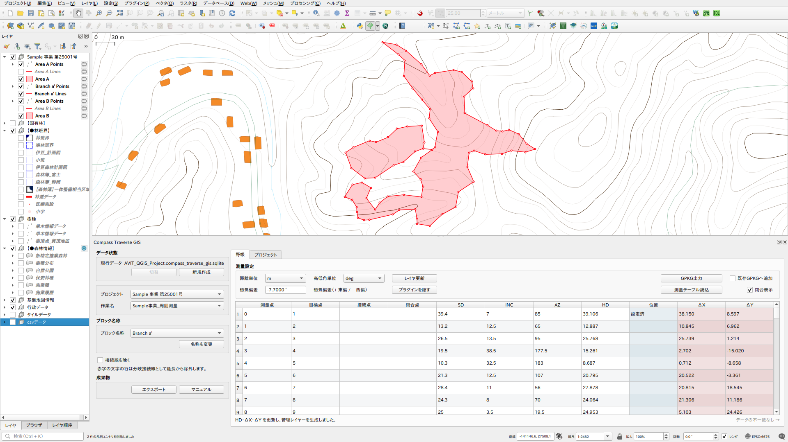
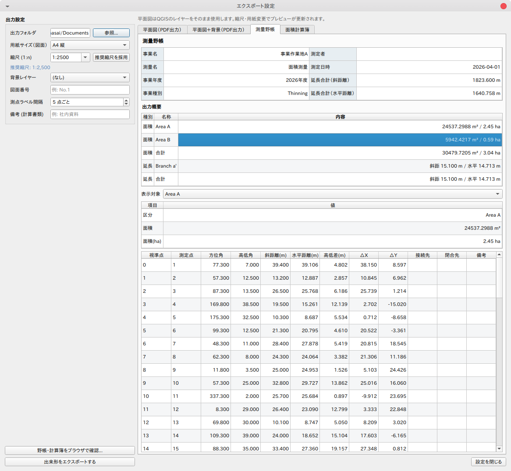
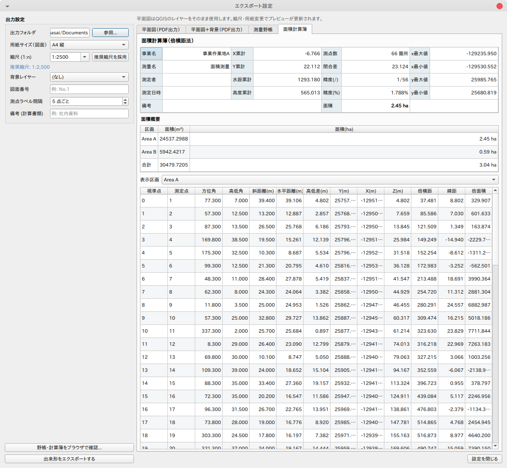

# Compass Traverse GIS

A QGIS plugin for compass survey notebook entry, traverse computation, and GIS layer output.



## Features

- **Field notebook**: Enter survey observations (From, To, Connect To, Close To, SD, INC, AZ, HD, Geo) in a table-based interface
- **CSV / Excel import**: Load existing survey sheets with automatic column detection
- **Traverse computation**: Calculates HD, dX, and dY; generates point, line, and polygon layers
- **Closure adjustment**: Optional bowditch-style correction for closed traverses
- **Magnetic declination**: Apply a declination offset to all azimuth values
- **Multiple projects / works**: Organize observations by project name and work name within a single workspace
- **Workspace management**: Data is stored in a SQLite sidecar file alongside the QGIS project; past datasets can be archived and restored
- **Export**: Generate an HTML report and map PDF when a work record is marked complete
- **Language toggle**: Switch between Japanese and English in-plugin

## Data storage

Survey data is stored in a SQLite file in the same folder as the QGIS project file.

```
 your_project/
 ├── survey.qgz                         ← QGIS project
 ├── survey.compass_traverse_gis.sqlite ← plugin data (observations, settings)
 └── _compass_traverse_gis_archive/     ← archived past datasets
```

The sidecar file is created automatically when the QGIS project is first saved.
Archiving the current dataset and starting a new one is done from the **Workspace Status** group in the left panel.

## Field notebook columns

| Column | Description |
|--------|-------------|
| From | Survey station (start of leg) |
| To | Target station (end of leg) |
| Connect To | Station this leg connects to (cross-block link) |
| Close To | Station this leg closes to (closure) |
| SD | Slope distance |
| INC | Inclination angle or percent gradient |
| AZ | Azimuth |
| HD | Horizontal distance (computed or entered) |
| Geo | Latitude / longitude anchor for coordinate back-calculation |
| dX | Easting offset (computed) |
| dY | Northing offset (computed) |

Distance unit (m / ft) and inclination unit (deg / pct) are selected per workspace.

## CSV / Excel import

Click **Import Survey Table** to load a `.csv`, `.xlsx`, `.xls`, or `.xlsm` file.
Column headers are matched automatically; the mapping can be adjusted before importing.
At minimum, the **From** and **To** columns must be mapped.

Auto-detected keywords:

| Column | Example keywords |
|--------|-----------------|
| From | from, 測量点, 測点, 起点 |
| To | to, target, 目標点 |
| Connect To | connect, 接続点 |
| Close To | close, 閉合点 |
| SD | SD, slope distance, 斜距離 |
| INC | INC, inclination, 高低角 |
| AZ | AZ, azimuth, 方位角 |
| HD | HD, horizontal distance, 水平距離 |
| Latitude | lat, latitude, 緯度 |
| Longitude | lon, longitude, 経度 |

## Export

Export is available only when the work record's **Completion** flag is set to 1.
The output includes an HTML survey report and a map PDF; the output folder is chosen in the Export dialog.

| Field notebook | Area calculation |
|---|---|
|  |  |

## Requirements

- QGIS 3.22 or later

## Support

If this plugin is helpful for your work, you can support the development here:
https://paypal.me/rawslnc

## License

This plugin is distributed under the GNU General Public License v2 or later.
See [LICENSE](LICENSE) for details.

## Author

Copyright (C) 2026 Hideharu Masai
